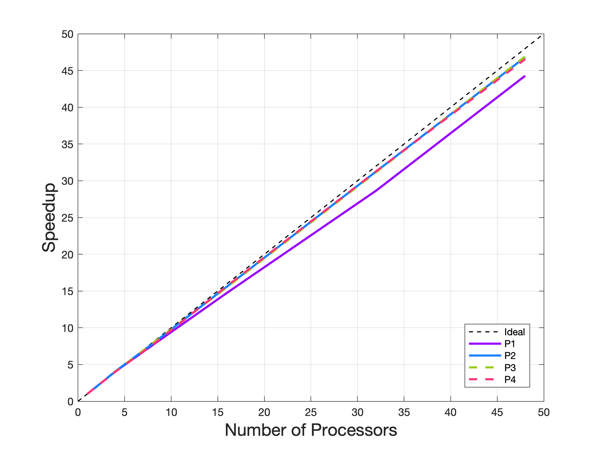

# Repository purpose
 This repository houses an Asynchronous Particle Swarm Optimization (APSO) implemented in C++ using non-blocking features of MPI for use in shared and distributed memory systems.

 # Approach Highlights
 This APSO technique uses asynchronous message handling and a relaxation of the global best position to help ensure parallel scalability of the method while still expecting relatively good convergence. The swarm is partitioned into subsets where each partition resides on some process. Locally to a process, it will perform the typical PSO method but each process will maintain a _global best position estimate_ that will be updated not only by local particles, but also via messages from other partitions. 

 The way it works is, the user can specify how often we care to check messages and send out what our current estimate is for the global best solution. When a local process decides to send out its global best solution estimate, it will choose a small constant sized random subset of the partitions to send the non-blocking message to. When those partitions receive the message, they will respond with their global best solution estimate, after first seeing if the estimate they received beats what they have stored locally. All the message managing is handled whenever the local swarm decides it cares. This randomized approach to spreading a partition's estimate ensures that gradually partitions will, in expectation, get the global best estimated location _eventually_. The local computations done on a process also allow for typical PSO results and convergence, implying this method should work fine even if there is a lag to getting the true global best solution across the whole distributed swarm.

 # Current Features
 The software contained in this project benefits from C++11 and some C++14 features and a relatively modular design. The asynchronous swarm is templated in terms of the objective function you care to optimize, allowing for compile time flexibility. The software manages the asynchronous communication and optimization loop for you already, so ultimately you just need to specify an objective function.

 # Future Plans
 This asynchronous PSO method was written recently (June 26th), so there has not been a lot of time to build out a lot of features. I would like to investigate some other topologies, perhaps even some other techniques for resolving particles that leave the hypercube search domain. I think it would be great to find a way to pass around particles if a given process is seeing it operates slower than some other process. I may consider

 # Sample Parallel Results
 The below figure is for a basic sample test problem that does 1000000 iterations with a fixed swarm size of 480 that gets distributed across 1, 2, 4, 8, 16, 32, and 48 processes, respectively. A speedup plot based on the strong scaling related data is shown below.

 

 The above figure shows that indeed the algorithm appears to scale pretty well, though it is totally reasonable to expect there might be some work to do to improve the efficiency further.

 # Contact Info
 Email: choward1491@gmail.com

